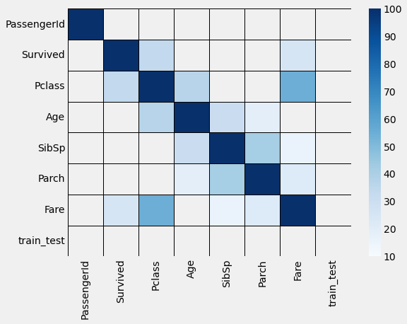
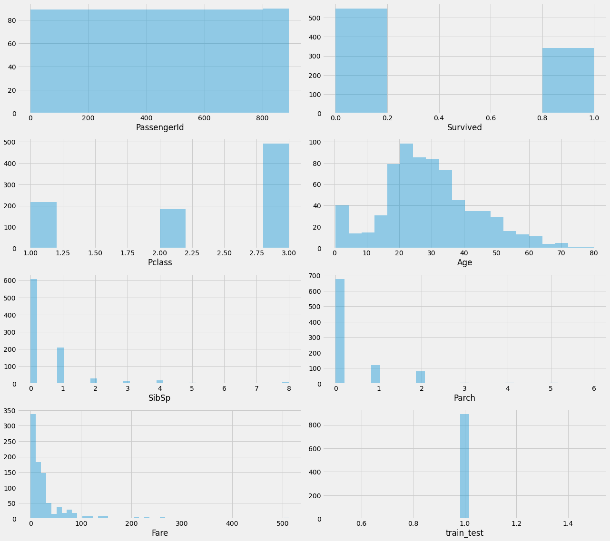
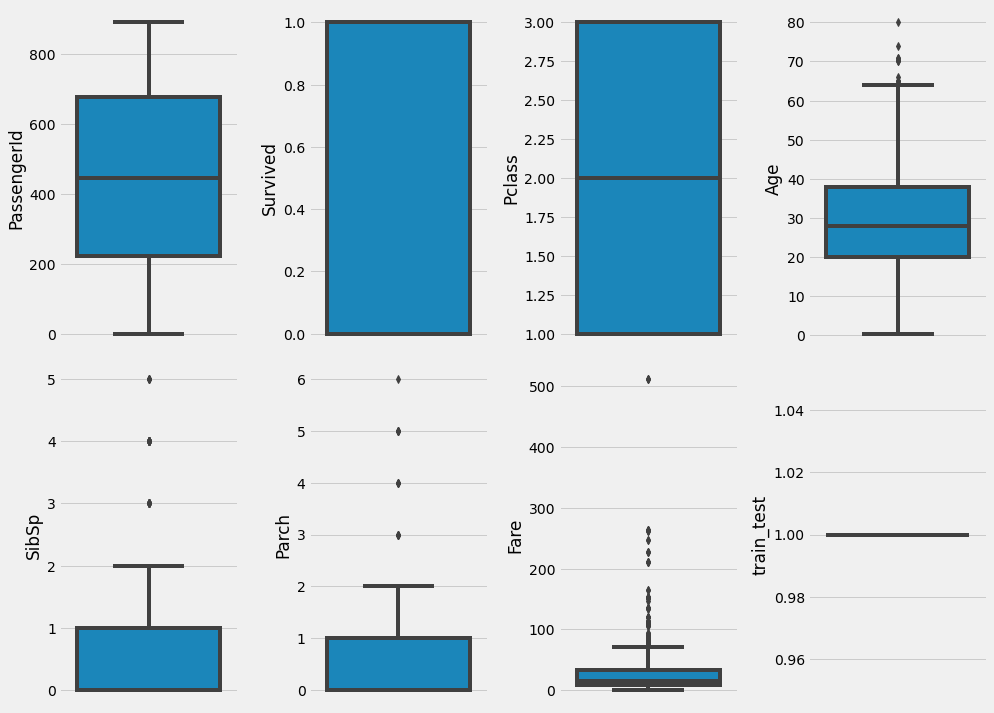
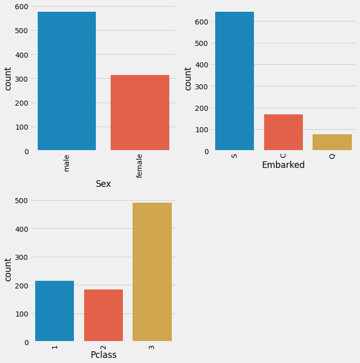
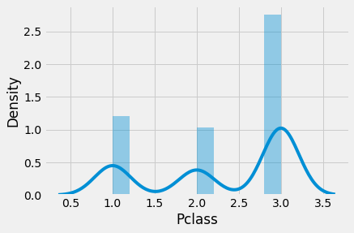
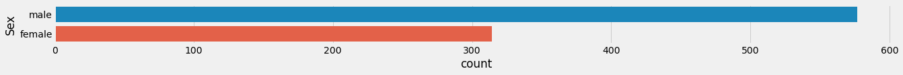
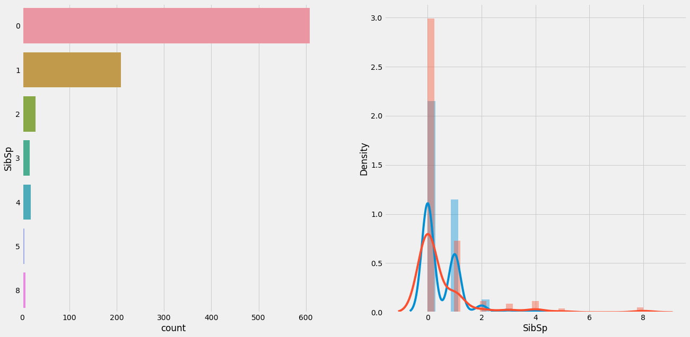
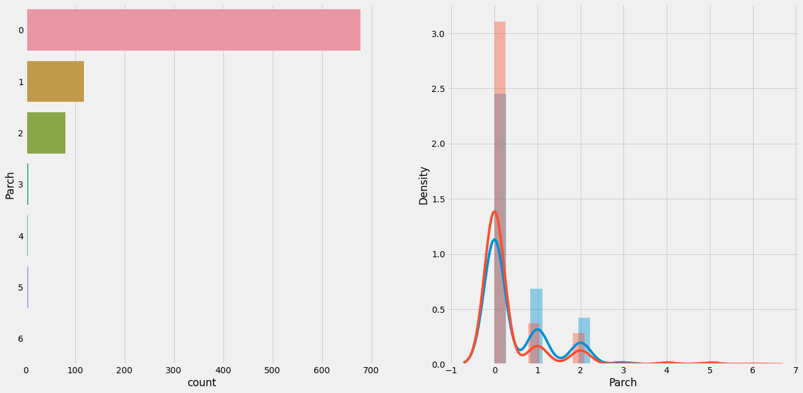
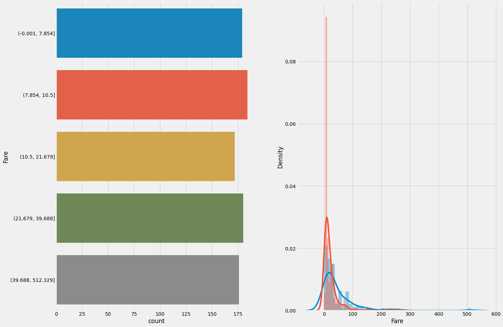

# Titanic Overview

This project aims to predict the survival of passengers on the Titanic based on various features such as age, sex, class, and fare. The project uses machine learning algorithms to train models on the Titanic dataset and evaluate their performance.

## Contents

- `gender_submission.csv`: A sample submission file in the correct format.
- `README.md`: This file, providing an overview of the project.
- `test.csv`: The test dataset used for making predictions.
- `Titanic_cross_validation.ipynb`: Jupyter notebook for cross-validation and model evaluation.
- `Titanic_model.ipynb`: Jupyter notebook for building and training the predictive model.
- `train.csv`: The training dataset used to build the model.


## Models
The project uses several machine learning algorithms, including:

- Decision Tree Classifier
- Linear Support Vector Machine (SVM)
- Gradient Boosting Classifier
- K-Nearest Neighbors (KNN)
- Naive Bayes
- Logistic Regression

## Performance Metrics
The project evaluates the performance of each model using accuracy, precision, recall, and F1-score.

## Requirements
- Python 3.x
- Jupyter Notebook
- scikit-learn
- pandas
- numpy
- matplotlib
- seaborn

# Implementation

## EDA, Feature engineering and Model Building.  

```python
import numpy as np 
import pandas as pd 
import seaborn as sns 
import matplotlib.pyplot as plt
plt.style.use('fivethirtyeight')
```


```python
train = pd.read_csv('titanic/train.csv')
test = pd.read_csv('titanic/test.csv')
```


```python
train['train_test'] = 1
test['train_test'] = 0
test['Survived'] = np.NaN
df = pd.concat([train,test])
```

## Analysis 


```python
df.describe()
```


<div>
<style scoped>
    .dataframe tbody tr th:only-of-type {
        vertical-align: middle;
    }

    .dataframe tbody tr th {
        vertical-align: top;
    }

    .dataframe thead th {
        text-align: right;
    }
</style>
<table border="1" class="dataframe">
  <thead>
    <tr style="text-align: right;">
      <th></th>
      <th>PassengerId</th>
      <th>Survived</th>
      <th>Pclass</th>
      <th>Age</th>
      <th>SibSp</th>
      <th>Parch</th>
      <th>Fare</th>
      <th>train_test</th>
    </tr>
  </thead>
  <tbody>
    <tr>
      <th>count</th>
      <td>1309.000000</td>
      <td>891.000000</td>
      <td>1309.000000</td>
      <td>1046.000000</td>
      <td>1309.000000</td>
      <td>1309.000000</td>
      <td>1308.000000</td>
      <td>1309.000000</td>
    </tr>
    <tr>
      <th>mean</th>
      <td>655.000000</td>
      <td>0.383838</td>
      <td>2.294882</td>
      <td>29.881138</td>
      <td>0.498854</td>
      <td>0.385027</td>
      <td>33.295479</td>
      <td>0.680672</td>
    </tr>
    <tr>
      <th>std</th>
      <td>378.020061</td>
      <td>0.486592</td>
      <td>0.837836</td>
      <td>14.413493</td>
      <td>1.041658</td>
      <td>0.865560</td>
      <td>51.758668</td>
      <td>0.466394</td>
    </tr>
    <tr>
      <th>min</th>
      <td>1.000000</td>
      <td>0.000000</td>
      <td>1.000000</td>
      <td>0.170000</td>
      <td>0.000000</td>
      <td>0.000000</td>
      <td>0.000000</td>
      <td>0.000000</td>
    </tr>
    <tr>
      <th>25%</th>
      <td>328.000000</td>
      <td>0.000000</td>
      <td>2.000000</td>
      <td>21.000000</td>
      <td>0.000000</td>
      <td>0.000000</td>
      <td>7.895800</td>
      <td>0.000000</td>
    </tr>
    <tr>
      <th>50%</th>
      <td>655.000000</td>
      <td>0.000000</td>
      <td>3.000000</td>
      <td>28.000000</td>
      <td>0.000000</td>
      <td>0.000000</td>
      <td>14.454200</td>
      <td>1.000000</td>
    </tr>
    <tr>
      <th>75%</th>
      <td>982.000000</td>
      <td>1.000000</td>
      <td>3.000000</td>
      <td>39.000000</td>
      <td>1.000000</td>
      <td>0.000000</td>
      <td>31.275000</td>
      <td>1.000000</td>
    </tr>
    <tr>
      <th>max</th>
      <td>1309.000000</td>
      <td>1.000000</td>
      <td>3.000000</td>
      <td>80.000000</td>
      <td>8.000000</td>
      <td>9.000000</td>
      <td>512.329200</td>
      <td>1.000000</td>
    </tr>
  </tbody>
</table>
</div>


```python
df.dtypes
```


    PassengerId      int64
    Survived       float64
    Pclass           int64
    Name            object
    Sex             object
    Age            float64
    SibSp            int64
    Parch            int64
    Ticket          object
    Fare           float64
    Cabin           object
    Embarked        object
    train_test       int64
    dtype: object


```python
numeric = train.select_dtypes(exclude='object')
numeric.columns
```


    Index(['PassengerId', 'Survived', 'Pclass', 'Age', 'SibSp', 'Parch', 'Fare',
           'train_test'],
          dtype='object')


```python
#correlation with prediction/target var

correlation = abs(numeric.corr()*100)
correlation[['Survived']].sort_values(['Survived'], ascending=False)

```


<div>
<style scoped>
    .dataframe tbody tr th:only-of-type {
        vertical-align: middle;
    }

    .dataframe tbody tr th {
        vertical-align: top;
    }

    .dataframe thead th {
        text-align: right;
    }
</style>
<table border="1" class="dataframe">
  <thead>
    <tr style="text-align: right;">
      <th></th>
      <th>Survived</th>
    </tr>
  </thead>
  <tbody>
    <tr>
      <th>Survived</th>
      <td>100.000000</td>
    </tr>
    <tr>
      <th>Pclass</th>
      <td>33.848104</td>
    </tr>
    <tr>
      <th>Fare</th>
      <td>25.730652</td>
    </tr>
    <tr>
      <th>Parch</th>
      <td>8.162941</td>
    </tr>
    <tr>
      <th>Age</th>
      <td>7.722109</td>
    </tr>
    <tr>
      <th>SibSp</th>
      <td>3.532250</td>
    </tr>
    <tr>
      <th>PassengerId</th>
      <td>0.500666</td>
    </tr>
    <tr>
      <th>train_test</th>
      <td>NaN</td>
    </tr>
  </tbody>
</table>
</div>


```python
plt.figure(figsize=(8,6))
sns.heatmap(correlation, mask=correlation<10, cmap='Blues', vmin=10, linewidths=.5, linecolor='k')
```


    <AxesSubplot:>


    

    


```python
fig = plt.figure(figsize=(18,16))

for index, col in enumerate(numeric.columns):
     plt.subplot(4,2,index+1)
     sns.distplot(numeric.loc[:,col].dropna(), kde=False)
     
fig.tight_layout(pad=1.0)
```

    

    

```python
# Outliers 

fig =  plt.figure(figsize=(14,20))
for index , col in enumerate(numeric.columns):
    plt.subplot(4,4, index+1)
    sns.boxplot(y=col, data=numeric.dropna())
fig.tight_layout(pad=1.0)
```


    

    


```python
cat = train.select_dtypes(include=['object']).copy()
cat['Pclass'] = train['Pclass']
cat = cat.drop(['Ticket', 'Cabin', 'Name'], axis=1) #droped knowing it has a lot of possible values
cat.columns
```


    Index(['Sex', 'Embarked', 'Pclass'], dtype='object')


```python
fig = plt.figure(figsize=(10,20))
for index in range(len(cat.columns)):
    plt.subplot(4,2,index+1)
    sns.countplot(x=cat.iloc[:,index],data=cat.dropna())
    plt.xticks(rotation=90)
fig.tight_layout(pad=1.0)
```


    

    


## Transformation 


```python
df.isnull().sum().nlargest(40)  
```


    Cabin          1014
    Survived        418
    Age             263
    Embarked          2
    Fare              1
    PassengerId       0
    Pclass            0
    Name              0
    Sex               0
    SibSp             0
    Parch             0
    Ticket            0
    train_test        0
    dtype: int64


```python
df = df.drop(['Cabin'],axis=1)
```


```python
#Filling missing Age values based on the median of the name tiltle (Mss. Mr. Mrs. etc)

import re
df['name_titles'] = df['Name'].apply(lambda x: re.findall(',\s(\w*).',x)[0])
df['Age'] = df.groupby('name_titles')['Age'].transform(lambda x: x.fillna(x.median()))
```


```python
df['Embarked'] = df['Embarked'].fillna('S')
df['Embarked'].unique()
```


    array(['S', 'C', 'Q'], dtype=object)


```python
df['Fare'] = df.groupby('Pclass')['Fare'].transform(lambda x: x.fillna(x.mean()))
```


```python
df.isnull().sum().nlargest(40) 
```


    Survived       418
    PassengerId      0
    Pclass           0
    Name             0
    Sex              0
    Age              0
    SibSp            0
    Parch            0
    Ticket           0
    Fare             0
    Embarked         0
    train_test       0
    name_titles      0
    dtype: int64


```python
df['fam'] = df['SibSp']+ df['Parch']
```


```python
df = df.drop(['PassengerId', 'Name', 'Ticket', 'name_titles', 'Embarked', 'SibSp', 'Parch'], axis=1)
df
```


<div>
<style scoped>
    .dataframe tbody tr th:only-of-type {
        vertical-align: middle;
    }

    .dataframe tbody tr th {
        vertical-align: top;
    }

    .dataframe thead th {
        text-align: right;
    }
</style>
<table border="1" class="dataframe">
  <thead>
    <tr style="text-align: right;">
      <th></th>
      <th>Survived</th>
      <th>Pclass</th>
      <th>Sex</th>
      <th>Age</th>
      <th>Fare</th>
      <th>train_test</th>
      <th>fam</th>
    </tr>
  </thead>
  <tbody>
    <tr>
      <th>0</th>
      <td>0.0</td>
      <td>3</td>
      <td>male</td>
      <td>22.0</td>
      <td>7.2500</td>
      <td>1</td>
      <td>1</td>
    </tr>
    <tr>
      <th>1</th>
      <td>1.0</td>
      <td>1</td>
      <td>female</td>
      <td>38.0</td>
      <td>71.2833</td>
      <td>1</td>
      <td>1</td>
    </tr>
    <tr>
      <th>2</th>
      <td>1.0</td>
      <td>3</td>
      <td>female</td>
      <td>26.0</td>
      <td>7.9250</td>
      <td>1</td>
      <td>0</td>
    </tr>
    <tr>
      <th>3</th>
      <td>1.0</td>
      <td>1</td>
      <td>female</td>
      <td>35.0</td>
      <td>53.1000</td>
      <td>1</td>
      <td>1</td>
    </tr>
    <tr>
      <th>4</th>
      <td>0.0</td>
      <td>3</td>
      <td>male</td>
      <td>35.0</td>
      <td>8.0500</td>
      <td>1</td>
      <td>0</td>
    </tr>
    <tr>
      <th>...</th>
      <td>...</td>
      <td>...</td>
      <td>...</td>
      <td>...</td>
      <td>...</td>
      <td>...</td>
      <td>...</td>
    </tr>
    <tr>
      <th>413</th>
      <td>NaN</td>
      <td>3</td>
      <td>male</td>
      <td>29.0</td>
      <td>8.0500</td>
      <td>0</td>
      <td>0</td>
    </tr>
    <tr>
      <th>414</th>
      <td>NaN</td>
      <td>1</td>
      <td>female</td>
      <td>39.0</td>
      <td>108.9000</td>
      <td>0</td>
      <td>0</td>
    </tr>
    <tr>
      <th>415</th>
      <td>NaN</td>
      <td>3</td>
      <td>male</td>
      <td>38.5</td>
      <td>7.2500</td>
      <td>0</td>
      <td>0</td>
    </tr>
    <tr>
      <th>416</th>
      <td>NaN</td>
      <td>3</td>
      <td>male</td>
      <td>29.0</td>
      <td>8.0500</td>
      <td>0</td>
      <td>0</td>
    </tr>
    <tr>
      <th>417</th>
      <td>NaN</td>
      <td>3</td>
      <td>male</td>
      <td>4.0</td>
      <td>22.3583</td>
      <td>0</td>
      <td>2</td>
    </tr>
  </tbody>
</table>
<p>1309 rows × 7 columns</p>
</div>


```python
#converting Sex and Embarked into Binary 
df['Sex'] = np.where(df['Sex']== 'female', 1,0)
df = pd.get_dummies(df, columns=['Sex'])
df
```


<div>
<style scoped>
    .dataframe tbody tr th:only-of-type {
        vertical-align: middle;
    }

    .dataframe tbody tr th {
        vertical-align: top;
    }

    .dataframe thead th {
        text-align: right;
    }
</style>
<table border="1" class="dataframe">
  <thead>
    <tr style="text-align: right;">
      <th></th>
      <th>Survived</th>
      <th>Pclass</th>
      <th>Age</th>
      <th>Fare</th>
      <th>train_test</th>
      <th>fam</th>
      <th>Sex_0</th>
      <th>Sex_1</th>
    </tr>
  </thead>
  <tbody>
    <tr>
      <th>0</th>
      <td>0.0</td>
      <td>3</td>
      <td>22.0</td>
      <td>7.2500</td>
      <td>1</td>
      <td>1</td>
      <td>1</td>
      <td>0</td>
    </tr>
    <tr>
      <th>1</th>
      <td>1.0</td>
      <td>1</td>
      <td>38.0</td>
      <td>71.2833</td>
      <td>1</td>
      <td>1</td>
      <td>0</td>
      <td>1</td>
    </tr>
    <tr>
      <th>2</th>
      <td>1.0</td>
      <td>3</td>
      <td>26.0</td>
      <td>7.9250</td>
      <td>1</td>
      <td>0</td>
      <td>0</td>
      <td>1</td>
    </tr>
    <tr>
      <th>3</th>
      <td>1.0</td>
      <td>1</td>
      <td>35.0</td>
      <td>53.1000</td>
      <td>1</td>
      <td>1</td>
      <td>0</td>
      <td>1</td>
    </tr>
    <tr>
      <th>4</th>
      <td>0.0</td>
      <td>3</td>
      <td>35.0</td>
      <td>8.0500</td>
      <td>1</td>
      <td>0</td>
      <td>1</td>
      <td>0</td>
    </tr>
    <tr>
      <th>...</th>
      <td>...</td>
      <td>...</td>
      <td>...</td>
      <td>...</td>
      <td>...</td>
      <td>...</td>
      <td>...</td>
      <td>...</td>
    </tr>
    <tr>
      <th>413</th>
      <td>NaN</td>
      <td>3</td>
      <td>29.0</td>
      <td>8.0500</td>
      <td>0</td>
      <td>0</td>
      <td>1</td>
      <td>0</td>
    </tr>
    <tr>
      <th>414</th>
      <td>NaN</td>
      <td>1</td>
      <td>39.0</td>
      <td>108.9000</td>
      <td>0</td>
      <td>0</td>
      <td>0</td>
      <td>1</td>
    </tr>
    <tr>
      <th>415</th>
      <td>NaN</td>
      <td>3</td>
      <td>38.5</td>
      <td>7.2500</td>
      <td>0</td>
      <td>0</td>
      <td>1</td>
      <td>0</td>
    </tr>
    <tr>
      <th>416</th>
      <td>NaN</td>
      <td>3</td>
      <td>29.0</td>
      <td>8.0500</td>
      <td>0</td>
      <td>0</td>
      <td>1</td>
      <td>0</td>
    </tr>
    <tr>
      <th>417</th>
      <td>NaN</td>
      <td>3</td>
      <td>4.0</td>
      <td>22.3583</td>
      <td>0</td>
      <td>2</td>
      <td>1</td>
      <td>0</td>
    </tr>
  </tbody>
</table>
<p>1309 rows × 8 columns</p>
</div>


```python
dfbin = df.copy()
dfbin['Fare'] = pd.qcut(dfbin['Fare'], 5)
dfbin = pd.get_dummies(dfbin, columns=['Fare', 'Pclass', 'fam'])
dfbin
```


<div>
<style scoped>
    .dataframe tbody tr th:only-of-type {
        vertical-align: middle;
    }

    .dataframe tbody tr th {
        vertical-align: top;
    }

    .dataframe thead th {
        text-align: right;
    }
</style>
<table border="1" class="dataframe">
  <thead>
    <tr style="text-align: right;">
      <th></th>
      <th>Survived</th>
      <th>Age</th>
      <th>train_test</th>
      <th>Sex_0</th>
      <th>Sex_1</th>
      <th>Fare_(-0.001, 7.854]</th>
      <th>Fare_(7.854, 10.5]</th>
      <th>Fare_(10.5, 21.558]</th>
      <th>Fare_(21.558, 41.579]</th>
      <th>Fare_(41.579, 512.329]</th>
      <th>...</th>
      <th>Pclass_3</th>
      <th>fam_0</th>
      <th>fam_1</th>
      <th>fam_2</th>
      <th>fam_3</th>
      <th>fam_4</th>
      <th>fam_5</th>
      <th>fam_6</th>
      <th>fam_7</th>
      <th>fam_10</th>
    </tr>
  </thead>
  <tbody>
    <tr>
      <th>0</th>
      <td>0.0</td>
      <td>22.0</td>
      <td>1</td>
      <td>1</td>
      <td>0</td>
      <td>1</td>
      <td>0</td>
      <td>0</td>
      <td>0</td>
      <td>0</td>
      <td>...</td>
      <td>1</td>
      <td>0</td>
      <td>1</td>
      <td>0</td>
      <td>0</td>
      <td>0</td>
      <td>0</td>
      <td>0</td>
      <td>0</td>
      <td>0</td>
    </tr>
    <tr>
      <th>1</th>
      <td>1.0</td>
      <td>38.0</td>
      <td>1</td>
      <td>0</td>
      <td>1</td>
      <td>0</td>
      <td>0</td>
      <td>0</td>
      <td>0</td>
      <td>1</td>
      <td>...</td>
      <td>0</td>
      <td>0</td>
      <td>1</td>
      <td>0</td>
      <td>0</td>
      <td>0</td>
      <td>0</td>
      <td>0</td>
      <td>0</td>
      <td>0</td>
    </tr>
    <tr>
      <th>2</th>
      <td>1.0</td>
      <td>26.0</td>
      <td>1</td>
      <td>0</td>
      <td>1</td>
      <td>0</td>
      <td>1</td>
      <td>0</td>
      <td>0</td>
      <td>0</td>
      <td>...</td>
      <td>1</td>
      <td>1</td>
      <td>0</td>
      <td>0</td>
      <td>0</td>
      <td>0</td>
      <td>0</td>
      <td>0</td>
      <td>0</td>
      <td>0</td>
    </tr>
    <tr>
      <th>3</th>
      <td>1.0</td>
      <td>35.0</td>
      <td>1</td>
      <td>0</td>
      <td>1</td>
      <td>0</td>
      <td>0</td>
      <td>0</td>
      <td>0</td>
      <td>1</td>
      <td>...</td>
      <td>0</td>
      <td>0</td>
      <td>1</td>
      <td>0</td>
      <td>0</td>
      <td>0</td>
      <td>0</td>
      <td>0</td>
      <td>0</td>
      <td>0</td>
    </tr>
    <tr>
      <th>4</th>
      <td>0.0</td>
      <td>35.0</td>
      <td>1</td>
      <td>1</td>
      <td>0</td>
      <td>0</td>
      <td>1</td>
      <td>0</td>
      <td>0</td>
      <td>0</td>
      <td>...</td>
      <td>1</td>
      <td>1</td>
      <td>0</td>
      <td>0</td>
      <td>0</td>
      <td>0</td>
      <td>0</td>
      <td>0</td>
      <td>0</td>
      <td>0</td>
    </tr>
    <tr>
      <th>...</th>
      <td>...</td>
      <td>...</td>
      <td>...</td>
      <td>...</td>
      <td>...</td>
      <td>...</td>
      <td>...</td>
      <td>...</td>
      <td>...</td>
      <td>...</td>
      <td>...</td>
      <td>...</td>
      <td>...</td>
      <td>...</td>
      <td>...</td>
      <td>...</td>
      <td>...</td>
      <td>...</td>
      <td>...</td>
      <td>...</td>
      <td>...</td>
    </tr>
    <tr>
      <th>413</th>
      <td>NaN</td>
      <td>29.0</td>
      <td>0</td>
      <td>1</td>
      <td>0</td>
      <td>0</td>
      <td>1</td>
      <td>0</td>
      <td>0</td>
      <td>0</td>
      <td>...</td>
      <td>1</td>
      <td>1</td>
      <td>0</td>
      <td>0</td>
      <td>0</td>
      <td>0</td>
      <td>0</td>
      <td>0</td>
      <td>0</td>
      <td>0</td>
    </tr>
    <tr>
      <th>414</th>
      <td>NaN</td>
      <td>39.0</td>
      <td>0</td>
      <td>0</td>
      <td>1</td>
      <td>0</td>
      <td>0</td>
      <td>0</td>
      <td>0</td>
      <td>1</td>
      <td>...</td>
      <td>0</td>
      <td>1</td>
      <td>0</td>
      <td>0</td>
      <td>0</td>
      <td>0</td>
      <td>0</td>
      <td>0</td>
      <td>0</td>
      <td>0</td>
    </tr>
    <tr>
      <th>415</th>
      <td>NaN</td>
      <td>38.5</td>
      <td>0</td>
      <td>1</td>
      <td>0</td>
      <td>1</td>
      <td>0</td>
      <td>0</td>
      <td>0</td>
      <td>0</td>
      <td>...</td>
      <td>1</td>
      <td>1</td>
      <td>0</td>
      <td>0</td>
      <td>0</td>
      <td>0</td>
      <td>0</td>
      <td>0</td>
      <td>0</td>
      <td>0</td>
    </tr>
    <tr>
      <th>416</th>
      <td>NaN</td>
      <td>29.0</td>
      <td>0</td>
      <td>1</td>
      <td>0</td>
      <td>0</td>
      <td>1</td>
      <td>0</td>
      <td>0</td>
      <td>0</td>
      <td>...</td>
      <td>1</td>
      <td>1</td>
      <td>0</td>
      <td>0</td>
      <td>0</td>
      <td>0</td>
      <td>0</td>
      <td>0</td>
      <td>0</td>
      <td>0</td>
    </tr>
    <tr>
      <th>417</th>
      <td>NaN</td>
      <td>4.0</td>
      <td>0</td>
      <td>1</td>
      <td>0</td>
      <td>0</td>
      <td>0</td>
      <td>0</td>
      <td>1</td>
      <td>0</td>
      <td>...</td>
      <td>1</td>
      <td>0</td>
      <td>0</td>
      <td>1</td>
      <td>0</td>
      <td>0</td>
      <td>0</td>
      <td>0</td>
      <td>0</td>
      <td>0</td>
    </tr>
  </tbody>
</table>
<p>1309 rows × 22 columns</p>
</div>


```python
# Separating Train and Test 

train_df = df[df['train_test']==1]
test_df = df[df['train_test']==0]
train_df = train_df.drop('train_test', axis=1)
test_df = test_df.drop('train_test', axis=1)
```


```python
train_dfbin = dfbin[dfbin['train_test']==1]
test_dfbin = dfbin[dfbin['train_test']==0]
train_dfbin = train_dfbin.drop('train_test', axis=1)
test_dfbin = test_dfbin.drop('train_test', axis=1)
```

## Fitting the model 


```python
train_dfbin_y = train_dfbin.Survived
train_dfbin_X = train_dfbin.drop(['Survived'], axis=1)
```


```python
train_df_y = train_df.Survived
train_df_X = train_df.drop(['Survived'], axis=1)

train_df_X
```


<div>
<style scoped>
    .dataframe tbody tr th:only-of-type {
        vertical-align: middle;
    }

    .dataframe tbody tr th {
        vertical-align: top;
    }

    .dataframe thead th {
        text-align: right;
    }
</style>
<table border="1" class="dataframe">
  <thead>
    <tr style="text-align: right;">
      <th></th>
      <th>Pclass</th>
      <th>Age</th>
      <th>Fare</th>
      <th>fam</th>
      <th>Sex_0</th>
      <th>Sex_1</th>
    </tr>
  </thead>
  <tbody>
    <tr>
      <th>0</th>
      <td>3</td>
      <td>22.0</td>
      <td>7.2500</td>
      <td>1</td>
      <td>1</td>
      <td>0</td>
    </tr>
    <tr>
      <th>1</th>
      <td>1</td>
      <td>38.0</td>
      <td>71.2833</td>
      <td>1</td>
      <td>0</td>
      <td>1</td>
    </tr>
    <tr>
      <th>2</th>
      <td>3</td>
      <td>26.0</td>
      <td>7.9250</td>
      <td>0</td>
      <td>0</td>
      <td>1</td>
    </tr>
    <tr>
      <th>3</th>
      <td>1</td>
      <td>35.0</td>
      <td>53.1000</td>
      <td>1</td>
      <td>0</td>
      <td>1</td>
    </tr>
    <tr>
      <th>4</th>
      <td>3</td>
      <td>35.0</td>
      <td>8.0500</td>
      <td>0</td>
      <td>1</td>
      <td>0</td>
    </tr>
    <tr>
      <th>...</th>
      <td>...</td>
      <td>...</td>
      <td>...</td>
      <td>...</td>
      <td>...</td>
      <td>...</td>
    </tr>
    <tr>
      <th>886</th>
      <td>2</td>
      <td>27.0</td>
      <td>13.0000</td>
      <td>0</td>
      <td>1</td>
      <td>0</td>
    </tr>
    <tr>
      <th>887</th>
      <td>1</td>
      <td>19.0</td>
      <td>30.0000</td>
      <td>0</td>
      <td>0</td>
      <td>1</td>
    </tr>
    <tr>
      <th>888</th>
      <td>3</td>
      <td>22.0</td>
      <td>23.4500</td>
      <td>3</td>
      <td>0</td>
      <td>1</td>
    </tr>
    <tr>
      <th>889</th>
      <td>1</td>
      <td>26.0</td>
      <td>30.0000</td>
      <td>0</td>
      <td>1</td>
      <td>0</td>
    </tr>
    <tr>
      <th>890</th>
      <td>3</td>
      <td>32.0</td>
      <td>7.7500</td>
      <td>0</td>
      <td>1</td>
      <td>0</td>
    </tr>
  </tbody>
</table>
<p>891 rows × 6 columns</p>
</div>


```python

from sklearn.ensemble import GradientBoostingClassifier
from sklearn import model_selection, metrics

model = GradientBoostingClassifier().fit(train_df_X, train_df_y)
accuracy =  round(model.score(train_df_X,train_df_y)*100,2)
cross_val = model_selection.cross_val_predict(GradientBoostingClassifier(n_estimators=150, learning_rate=0.1), train_df_X,train_df_y, cv=10, n_jobs=-1)
acc_cv = round(metrics.accuracy_score(train_df_y,cross_val)*100,2)
feature_ranks = pd.Series((model.feature_importances_)*100, index=train_df_X.columns).sort_values(ascending=False)

print('Acc ',accuracy )
print()
print('Cross val ', acc_cv)
print('Feature rank ')
print(feature_ranks)

```

    Acc  89.67
    
    Cross val  84.62
    Feature rank 
    Sex_1     24.076661
    Sex_0     22.933807
    Fare      17.025432
    Pclass    14.650911
    Age       12.053696
    fam        9.259494
    dtype: float64


## Cross Validation (using different models)


```python
import numpy as np 
import pandas as pd 
import seaborn as sns 
import matplotlib.pyplot as plt
plt.style.use('fivethirtyeight')
import math, time, random, datetime
```


```python
train = pd.read_csv('titanic/train.csv')
test = pd.read_csv('titanic/test.csv')

```


```python
train.isnull().sum()
```


    PassengerId      0
    Survived         0
    Pclass           0
    Name             0
    Sex              0
    Age            177
    SibSp            0
    Parch            0
    Ticket           0
    Fare             0
    Cabin          687
    Embarked         2
    dtype: int64


```python
df_bin =pd.DataFrame() #to store continuous variables in bins  ex(age bins: 0-10, 11-20, 21-31, etc..)
df_con = pd.DataFrame() # to store continuous variables 

train.dtypes
```


    PassengerId      int64
    Survived         int64
    Pclass           int64
    Name            object
    Sex             object
    Age            float64
    SibSp            int64
    Parch            int64
    Ticket          object
    Fare           float64
    Cabin           object
    Embarked        object
    dtype: object


```python
train.describe()
```


<div>
<style scoped>
    .dataframe tbody tr th:only-of-type {
        vertical-align: middle;
    }

    .dataframe tbody tr th {
        vertical-align: top;
    }

    .dataframe thead th {
        text-align: right;
    }
</style>
<table border="1" class="dataframe">
  <thead>
    <tr style="text-align: right;">
      <th></th>
      <th>PassengerId</th>
      <th>Survived</th>
      <th>Pclass</th>
      <th>Age</th>
      <th>SibSp</th>
      <th>Parch</th>
      <th>Fare</th>
    </tr>
  </thead>
  <tbody>
    <tr>
      <th>count</th>
      <td>891.000000</td>
      <td>891.000000</td>
      <td>891.000000</td>
      <td>714.000000</td>
      <td>891.000000</td>
      <td>891.000000</td>
      <td>891.000000</td>
    </tr>
    <tr>
      <th>mean</th>
      <td>446.000000</td>
      <td>0.383838</td>
      <td>2.308642</td>
      <td>29.699118</td>
      <td>0.523008</td>
      <td>0.381594</td>
      <td>32.204208</td>
    </tr>
    <tr>
      <th>std</th>
      <td>257.353842</td>
      <td>0.486592</td>
      <td>0.836071</td>
      <td>14.526497</td>
      <td>1.102743</td>
      <td>0.806057</td>
      <td>49.693429</td>
    </tr>
    <tr>
      <th>min</th>
      <td>1.000000</td>
      <td>0.000000</td>
      <td>1.000000</td>
      <td>0.420000</td>
      <td>0.000000</td>
      <td>0.000000</td>
      <td>0.000000</td>
    </tr>
    <tr>
      <th>25%</th>
      <td>223.500000</td>
      <td>0.000000</td>
      <td>2.000000</td>
      <td>20.125000</td>
      <td>0.000000</td>
      <td>0.000000</td>
      <td>7.910400</td>
    </tr>
    <tr>
      <th>50%</th>
      <td>446.000000</td>
      <td>0.000000</td>
      <td>3.000000</td>
      <td>28.000000</td>
      <td>0.000000</td>
      <td>0.000000</td>
      <td>14.454200</td>
    </tr>
    <tr>
      <th>75%</th>
      <td>668.500000</td>
      <td>1.000000</td>
      <td>3.000000</td>
      <td>38.000000</td>
      <td>1.000000</td>
      <td>0.000000</td>
      <td>31.000000</td>
    </tr>
    <tr>
      <th>max</th>
      <td>891.000000</td>
      <td>1.000000</td>
      <td>3.000000</td>
      <td>80.000000</td>
      <td>8.000000</td>
      <td>6.000000</td>
      <td>512.329200</td>
    </tr>
  </tbody>
</table>
</div>


```python
fig = plt.figure(figsize=(20,1))
sns.countplot(y='Survived', data=train)
print(train.Survived.value_counts())
```

    0    549
    1    342
    Name: Survived, dtype: int64


    

    


```python
df_bin['Survived']= train['Survived']
df_con['Survived']= train['Survived']
```


```python
#Name ticket and Cabin have too many value types, hard to put in bins not so useful.
print(train.Name.value_counts().count())
print(train.Ticket.value_counts().count())
print(train.Cabin.value_counts().count())

```

    891
    681
    147


```python
sns.distplot(train.Pclass) # its Ordinal Data 
```
    

    


```python
df_bin['Pclass']= train['Pclass']
df_con['Pclass']= train['Pclass']
```

```python
plt.figure(figsize=(20,1))
sns.countplot(y='Sex', data=train)
```
    <AxesSubplot:xlabel='count', ylabel='Sex'>
 

    


```python

# Function to plot a count and a distribution(vs Survived) of each variable 

def plot_count_dist (data, bin_df, label_column, target_colum, figsize=(20,5), use_bin_fd=False):
    if use_bin_fd:
        fig= plt.figure(figsize=figsize)
        plt.subplot(1,2,1)
        sns.countplot(y=target_colum, data=bin_df)
        plt.subplot(1,2,2)
        sns.distplot(data.loc[data[label_column]==1][target_colum], kde_kws={'label':'Survived'})
        sns.distplot(data.loc[data[label_column]==0][target_colum], kde_kws={'label':'Did Not Survived'})
    else:
        fig= plt.figure(figsize=figsize)
        plt.subplot(1,2,1)
        sns.countplot(y=target_colum, data=data)
        plt.subplot(1,2,2)
        sns.distplot(data.loc[data[label_column]==1][target_colum], kde_kws={'label':'Survived'})
        sns.distplot(data.loc[data[label_column]==0][target_colum], kde_kws={'label':'Did Not Survived'})
```


```python
# Adding Sex and changing to binary form using np.where
df_bin['Sex'] = train['Sex']
df_bin['Sex'] = np.where(df_bin['Sex']== 'female', 1,0)
df_con['Sex'] = train['Sex']
```


```python
# Adding SibSp = num of Siblings/Spouse
df_bin['SibSp']= train['SibSp']
df_con['SibSp']= train['SibSp']
```


```python
plot_count_dist(train, bin_df=df_bin, label_column='Survived', target_colum='SibSp', figsize=(20,10))
```

    

    

```python
# Adding Parch = num of Parents/Children
df_bin['Parch']= train['Parch']
df_con['Parch']= train['Parch']
plot_count_dist(train, bin_df=df_bin, label_column='Survived', target_colum='Parch', figsize=(20,10))
```
    

    

```python
# Ading Fare, first variable to be cut into bins 
df_con['Fare'] = train['Fare']
df_bin['Fare'] = pd.qcut(train['Fare'], 5)
plot_count_dist(train,df_bin,'Survived', 'Fare', use_bin_fd=True, figsize=(20,15))
```
    

 

```python
# Embarqued
df_bin['Embarked'] = train['Embarked']
df_con['Embarked'] = train['Embarked']

```


```python
df_bin = df_bin.dropna(subset=['Embarked'])
df_con = df_con.dropna(subset=['Embarked'])
```


```python
import re
df_con['name_titles'] = train['Name'].apply(lambda x: re.findall(',\s(\w*).',x)[0])
df_con['Age'] = train['Age']
df_con['Age'] = df_con.groupby('name_titles')['Age'].transform(lambda x: x.fillna(x.median()))


```

## Feature Encoding 

```python
df_bin.head(20)
```

<div>
<style scoped>
    .dataframe tbody tr th:only-of-type {
        vertical-align: middle;
    }

    .dataframe tbody tr th {
        vertical-align: top;
    }

    .dataframe thead th {
        text-align: right;
    }
</style>
<table border="1" class="dataframe">
  <thead>
    <tr style="text-align: right;">
      <th></th>
      <th>Survived</th>
      <th>Pclass</th>
      <th>Sex</th>
      <th>SibSp</th>
      <th>Parch</th>
      <th>Fare</th>
      <th>Embarked</th>
    </tr>
  </thead>
  <tbody>
    <tr>
      <th>0</th>
      <td>0</td>
      <td>3</td>
      <td>0</td>
      <td>1</td>
      <td>0</td>
      <td>(-0.001, 7.854]</td>
      <td>S</td>
    </tr>
    <tr>
      <th>1</th>
      <td>1</td>
      <td>1</td>
      <td>1</td>
      <td>1</td>
      <td>0</td>
      <td>(39.688, 512.329]</td>
      <td>C</td>
    </tr>
    <tr>
      <th>2</th>
      <td>1</td>
      <td>3</td>
      <td>1</td>
      <td>0</td>
      <td>0</td>
      <td>(7.854, 10.5]</td>
      <td>S</td>
    </tr>
    <tr>
      <th>3</th>
      <td>1</td>
      <td>1</td>
      <td>1</td>
      <td>1</td>
      <td>0</td>
      <td>(39.688, 512.329]</td>
      <td>S</td>
    </tr>
    <tr>
      <th>4</th>
      <td>0</td>
      <td>3</td>
      <td>0</td>
      <td>0</td>
      <td>0</td>
      <td>(7.854, 10.5]</td>
      <td>S</td>
    </tr>
    <tr>
      <th>5</th>
      <td>0</td>
      <td>3</td>
      <td>0</td>
      <td>0</td>
      <td>0</td>
      <td>(7.854, 10.5]</td>
      <td>Q</td>
    </tr>
    <tr>
      <th>6</th>
      <td>0</td>
      <td>1</td>
      <td>0</td>
      <td>0</td>
      <td>0</td>
      <td>(39.688, 512.329]</td>
      <td>S</td>
    </tr>
    <tr>
      <th>7</th>
      <td>0</td>
      <td>3</td>
      <td>0</td>
      <td>3</td>
      <td>1</td>
      <td>(10.5, 21.679]</td>
      <td>S</td>
    </tr>
    <tr>
      <th>8</th>
      <td>1</td>
      <td>3</td>
      <td>1</td>
      <td>0</td>
      <td>2</td>
      <td>(10.5, 21.679]</td>
      <td>S</td>
    </tr>
    <tr>
      <th>9</th>
      <td>1</td>
      <td>2</td>
      <td>1</td>
      <td>1</td>
      <td>0</td>
      <td>(21.679, 39.688]</td>
      <td>C</td>
    </tr>
    <tr>
      <th>10</th>
      <td>1</td>
      <td>3</td>
      <td>1</td>
      <td>1</td>
      <td>1</td>
      <td>(10.5, 21.679]</td>
      <td>S</td>
    </tr>
    <tr>
      <th>11</th>
      <td>1</td>
      <td>1</td>
      <td>1</td>
      <td>0</td>
      <td>0</td>
      <td>(21.679, 39.688]</td>
      <td>S</td>
    </tr>
    <tr>
      <th>12</th>
      <td>0</td>
      <td>3</td>
      <td>0</td>
      <td>0</td>
      <td>0</td>
      <td>(7.854, 10.5]</td>
      <td>S</td>
    </tr>
    <tr>
      <th>13</th>
      <td>0</td>
      <td>3</td>
      <td>0</td>
      <td>1</td>
      <td>5</td>
      <td>(21.679, 39.688]</td>
      <td>S</td>
    </tr>
    <tr>
      <th>14</th>
      <td>0</td>
      <td>3</td>
      <td>1</td>
      <td>0</td>
      <td>0</td>
      <td>(-0.001, 7.854]</td>
      <td>S</td>
    </tr>
    <tr>
      <th>15</th>
      <td>1</td>
      <td>2</td>
      <td>1</td>
      <td>0</td>
      <td>0</td>
      <td>(10.5, 21.679]</td>
      <td>S</td>
    </tr>
    <tr>
      <th>16</th>
      <td>0</td>
      <td>3</td>
      <td>0</td>
      <td>4</td>
      <td>1</td>
      <td>(21.679, 39.688]</td>
      <td>Q</td>
    </tr>
    <tr>
      <th>17</th>
      <td>1</td>
      <td>2</td>
      <td>0</td>
      <td>0</td>
      <td>0</td>
      <td>(10.5, 21.679]</td>
      <td>S</td>
    </tr>
    <tr>
      <th>18</th>
      <td>0</td>
      <td>3</td>
      <td>1</td>
      <td>1</td>
      <td>0</td>
      <td>(10.5, 21.679]</td>
      <td>S</td>
    </tr>
    <tr>
      <th>19</th>
      <td>1</td>
      <td>3</td>
      <td>1</td>
      <td>0</td>
      <td>0</td>
      <td>(-0.001, 7.854]</td>
      <td>C</td>
    </tr>
  </tbody>
</table>
</div>


```python

from sklearn.preprocessing import OneHotEncoder, LabelEncoder, label_binarize
```

```python
#df_bin.drop('Survived', axis=1, inplace=True)
df_bin_enc = pd.get_dummies(df_bin, columns=['Pclass', 'Sex', 'SibSp', 'Parch', 'Fare', 'Embarked'])
df_bin_enc
```


<div>
<style scoped>
    .dataframe tbody tr th:only-of-type {
        vertical-align: middle;
    }

    .dataframe tbody tr th {
        vertical-align: top;
    }

    .dataframe thead th {
        text-align: right;
    }
</style>
<table border="1" class="dataframe">
  <thead>
    <tr style="text-align: right;">
      <th></th>
      <th>Survived</th>
      <th>Pclass_1</th>
      <th>Pclass_2</th>
      <th>Pclass_3</th>
      <th>Sex_0</th>
      <th>Sex_1</th>
      <th>SibSp_0</th>
      <th>SibSp_1</th>
      <th>SibSp_2</th>
      <th>SibSp_3</th>
      <th>...</th>
      <th>Parch_5</th>
      <th>Parch_6</th>
      <th>Fare_(-0.001, 7.854]</th>
      <th>Fare_(7.854, 10.5]</th>
      <th>Fare_(10.5, 21.679]</th>
      <th>Fare_(21.679, 39.688]</th>
      <th>Fare_(39.688, 512.329]</th>
      <th>Embarked_C</th>
      <th>Embarked_Q</th>
      <th>Embarked_S</th>
    </tr>
  </thead>
  <tbody>
    <tr>
      <th>0</th>
      <td>0</td>
      <td>0</td>
      <td>0</td>
      <td>1</td>
      <td>1</td>
      <td>0</td>
      <td>0</td>
      <td>1</td>
      <td>0</td>
      <td>0</td>
      <td>...</td>
      <td>0</td>
      <td>0</td>
      <td>1</td>
      <td>0</td>
      <td>0</td>
      <td>0</td>
      <td>0</td>
      <td>0</td>
      <td>0</td>
      <td>1</td>
    </tr>
    <tr>
      <th>1</th>
      <td>1</td>
      <td>1</td>
      <td>0</td>
      <td>0</td>
      <td>0</td>
      <td>1</td>
      <td>0</td>
      <td>1</td>
      <td>0</td>
      <td>0</td>
      <td>...</td>
      <td>0</td>
      <td>0</td>
      <td>0</td>
      <td>0</td>
      <td>0</td>
      <td>0</td>
      <td>1</td>
      <td>1</td>
      <td>0</td>
      <td>0</td>
    </tr>
    <tr>
      <th>2</th>
      <td>1</td>
      <td>0</td>
      <td>0</td>
      <td>1</td>
      <td>0</td>
      <td>1</td>
      <td>1</td>
      <td>0</td>
      <td>0</td>
      <td>0</td>
      <td>...</td>
      <td>0</td>
      <td>0</td>
      <td>0</td>
      <td>1</td>
      <td>0</td>
      <td>0</td>
      <td>0</td>
      <td>0</td>
      <td>0</td>
      <td>1</td>
    </tr>
    <tr>
      <th>3</th>
      <td>1</td>
      <td>1</td>
      <td>0</td>
      <td>0</td>
      <td>0</td>
      <td>1</td>
      <td>0</td>
      <td>1</td>
      <td>0</td>
      <td>0</td>
      <td>...</td>
      <td>0</td>
      <td>0</td>
      <td>0</td>
      <td>0</td>
      <td>0</td>
      <td>0</td>
      <td>1</td>
      <td>0</td>
      <td>0</td>
      <td>1</td>
    </tr>
    <tr>
      <th>4</th>
      <td>0</td>
      <td>0</td>
      <td>0</td>
      <td>1</td>
      <td>1</td>
      <td>0</td>
      <td>1</td>
      <td>0</td>
      <td>0</td>
      <td>0</td>
      <td>...</td>
      <td>0</td>
      <td>0</td>
      <td>0</td>
      <td>1</td>
      <td>0</td>
      <td>0</td>
      <td>0</td>
      <td>0</td>
      <td>0</td>
      <td>1</td>
    </tr>
    <tr>
      <th>...</th>
      <td>...</td>
      <td>...</td>
      <td>...</td>
      <td>...</td>
      <td>...</td>
      <td>...</td>
      <td>...</td>
      <td>...</td>
      <td>...</td>
      <td>...</td>
      <td>...</td>
      <td>...</td>
      <td>...</td>
      <td>...</td>
      <td>...</td>
      <td>...</td>
      <td>...</td>
      <td>...</td>
      <td>...</td>
      <td>...</td>
      <td>...</td>
    </tr>
    <tr>
      <th>886</th>
      <td>0</td>
      <td>0</td>
      <td>1</td>
      <td>0</td>
      <td>1</td>
      <td>0</td>
      <td>1</td>
      <td>0</td>
      <td>0</td>
      <td>0</td>
      <td>...</td>
      <td>0</td>
      <td>0</td>
      <td>0</td>
      <td>0</td>
      <td>1</td>
      <td>0</td>
      <td>0</td>
      <td>0</td>
      <td>0</td>
      <td>1</td>
    </tr>
    <tr>
      <th>887</th>
      <td>1</td>
      <td>1</td>
      <td>0</td>
      <td>0</td>
      <td>0</td>
      <td>1</td>
      <td>1</td>
      <td>0</td>
      <td>0</td>
      <td>0</td>
      <td>...</td>
      <td>0</td>
      <td>0</td>
      <td>0</td>
      <td>0</td>
      <td>0</td>
      <td>1</td>
      <td>0</td>
      <td>0</td>
      <td>0</td>
      <td>1</td>
    </tr>
    <tr>
      <th>888</th>
      <td>0</td>
      <td>0</td>
      <td>0</td>
      <td>1</td>
      <td>0</td>
      <td>1</td>
      <td>0</td>
      <td>1</td>
      <td>0</td>
      <td>0</td>
      <td>...</td>
      <td>0</td>
      <td>0</td>
      <td>0</td>
      <td>0</td>
      <td>0</td>
      <td>1</td>
      <td>0</td>
      <td>0</td>
      <td>0</td>
      <td>1</td>
    </tr>
    <tr>
      <th>889</th>
      <td>1</td>
      <td>1</td>
      <td>0</td>
      <td>0</td>
      <td>1</td>
      <td>0</td>
      <td>1</td>
      <td>0</td>
      <td>0</td>
      <td>0</td>
      <td>...</td>
      <td>0</td>
      <td>0</td>
      <td>0</td>
      <td>0</td>
      <td>0</td>
      <td>1</td>
      <td>0</td>
      <td>1</td>
      <td>0</td>
      <td>0</td>
    </tr>
    <tr>
      <th>890</th>
      <td>0</td>
      <td>0</td>
      <td>0</td>
      <td>1</td>
      <td>1</td>
      <td>0</td>
      <td>1</td>
      <td>0</td>
      <td>0</td>
      <td>0</td>
      <td>...</td>
      <td>0</td>
      <td>0</td>
      <td>1</td>
      <td>0</td>
      <td>0</td>
      <td>0</td>
      <td>0</td>
      <td>0</td>
      <td>1</td>
      <td>0</td>
    </tr>
  </tbody>
</table>
<p>889 rows × 28 columns</p>
</div>


```python
df_con_enc = pd.get_dummies(df_con, columns=['Sex', 'Embarked'])
df_con_enc
```


<div>
<style scoped>
    .dataframe tbody tr th:only-of-type {
        vertical-align: middle;
    }

    .dataframe tbody tr th {
        vertical-align: top;
    }

    .dataframe thead th {
        text-align: right;
    }
</style>
<table border="1" class="dataframe">
  <thead>
    <tr style="text-align: right;">
      <th></th>
      <th>Survived</th>
      <th>Pclass</th>
      <th>SibSp</th>
      <th>Parch</th>
      <th>Fare</th>
      <th>name_titles</th>
      <th>Age</th>
      <th>Sex_female</th>
      <th>Sex_male</th>
      <th>Embarked_C</th>
      <th>Embarked_Q</th>
      <th>Embarked_S</th>
    </tr>
  </thead>
  <tbody>
    <tr>
      <th>0</th>
      <td>0</td>
      <td>3</td>
      <td>1</td>
      <td>0</td>
      <td>7.2500</td>
      <td>Mr</td>
      <td>22.0</td>
      <td>0</td>
      <td>1</td>
      <td>0</td>
      <td>0</td>
      <td>1</td>
    </tr>
    <tr>
      <th>1</th>
      <td>1</td>
      <td>1</td>
      <td>1</td>
      <td>0</td>
      <td>71.2833</td>
      <td>Mrs</td>
      <td>38.0</td>
      <td>1</td>
      <td>0</td>
      <td>1</td>
      <td>0</td>
      <td>0</td>
    </tr>
    <tr>
      <th>2</th>
      <td>1</td>
      <td>3</td>
      <td>0</td>
      <td>0</td>
      <td>7.9250</td>
      <td>Miss</td>
      <td>26.0</td>
      <td>1</td>
      <td>0</td>
      <td>0</td>
      <td>0</td>
      <td>1</td>
    </tr>
    <tr>
      <th>3</th>
      <td>1</td>
      <td>1</td>
      <td>1</td>
      <td>0</td>
      <td>53.1000</td>
      <td>Mrs</td>
      <td>35.0</td>
      <td>1</td>
      <td>0</td>
      <td>0</td>
      <td>0</td>
      <td>1</td>
    </tr>
    <tr>
      <th>4</th>
      <td>0</td>
      <td>3</td>
      <td>0</td>
      <td>0</td>
      <td>8.0500</td>
      <td>Mr</td>
      <td>35.0</td>
      <td>0</td>
      <td>1</td>
      <td>0</td>
      <td>0</td>
      <td>1</td>
    </tr>
    <tr>
      <th>...</th>
      <td>...</td>
      <td>...</td>
      <td>...</td>
      <td>...</td>
      <td>...</td>
      <td>...</td>
      <td>...</td>
      <td>...</td>
      <td>...</td>
      <td>...</td>
      <td>...</td>
      <td>...</td>
    </tr>
    <tr>
      <th>886</th>
      <td>0</td>
      <td>2</td>
      <td>0</td>
      <td>0</td>
      <td>13.0000</td>
      <td>Rev</td>
      <td>27.0</td>
      <td>0</td>
      <td>1</td>
      <td>0</td>
      <td>0</td>
      <td>1</td>
    </tr>
    <tr>
      <th>887</th>
      <td>1</td>
      <td>1</td>
      <td>0</td>
      <td>0</td>
      <td>30.0000</td>
      <td>Miss</td>
      <td>19.0</td>
      <td>1</td>
      <td>0</td>
      <td>0</td>
      <td>0</td>
      <td>1</td>
    </tr>
    <tr>
      <th>888</th>
      <td>0</td>
      <td>3</td>
      <td>1</td>
      <td>2</td>
      <td>23.4500</td>
      <td>Miss</td>
      <td>21.0</td>
      <td>1</td>
      <td>0</td>
      <td>0</td>
      <td>0</td>
      <td>1</td>
    </tr>
    <tr>
      <th>889</th>
      <td>1</td>
      <td>1</td>
      <td>0</td>
      <td>0</td>
      <td>30.0000</td>
      <td>Mr</td>
      <td>26.0</td>
      <td>0</td>
      <td>1</td>
      <td>1</td>
      <td>0</td>
      <td>0</td>
    </tr>
    <tr>
      <th>890</th>
      <td>0</td>
      <td>3</td>
      <td>0</td>
      <td>0</td>
      <td>7.7500</td>
      <td>Mr</td>
      <td>32.0</td>
      <td>0</td>
      <td>1</td>
      <td>0</td>
      <td>1</td>
      <td>0</td>
    </tr>
  </tbody>
</table>
<p>889 rows × 12 columns</p>
</div>


# Building Models 🙆🏽‍♂️


```python
X_train_bin = df_bin_enc.drop('Survived', axis=1)
y_train_bin = df_bin_enc.Survived
X_train_con = df_con_enc.drop(['Survived','name_titles'], axis=1)
y_train_con = df_con_enc.Survived
```


```python
from sklearn import model_selection, metrics
from sklearn.svm import LinearSVC
from sklearn.ensemble import GradientBoostingClassifier
from sklearn.neighbors import KNeighborsClassifier
from sklearn.naive_bayes import GaussianNB
from sklearn.linear_model import LinearRegression, LogisticRegression, SGDClassifier
from sklearn.tree import DecisionTreeClassifier
```


```python
# Function to run different algorithm with cross val 

def fit_algo(algo, X_train, y_train, cv): #cv Cross validate, number of times try 10 
    model = algo.fit(X_train, y_train)
    accuracy =  round(model.score(X_train,y_train)*100,2)
    cross_val = model_selection.cross_val_predict(algo, X_train,y_train, cv=cv, n_jobs=-1)
    acc_cv = round(metrics.accuracy_score(y_train,cross_val)*100,2)
    #feature_ranks = pd.Series((model.feature_importances_)*100, index=X_train.columns).sort_values(ascending=False)
    return accuracy, acc_cv, #feature_ranks
```

### TOP Performing Algorithms 


```python
acc_grad_boost, cross_grad_boost, featureranks = fit_algo(GradientBoostingClassifier(n_estimators=300, learning_rate=0.1), X_train_con, y_train_con,10)

print('General Acc is ' , acc_grad_boost)
print()
print('With cross val is ',cross_grad_boost)
print()
print(featureranks)
```

    General Acc is  94.94
    
    With cross val is  84.03
    
    Sex_female    22.476185
    Fare          21.774555
    Sex_male      17.517075
    Age           16.592819
    Pclass        12.358341
    SibSp          5.821414
    Embarked_S     1.495644
    Parch          1.172607
    Embarked_Q     0.420607
    Embarked_C     0.370754
    dtype: float64


```python
acc_dTree, cross_dTree = fit_algo( DecisionTreeClassifier(),  X_train_con, y_train_con, 10)

print('General Acc is ' , acc_dTree)
print()
print('With cross val is ',cross_dTree)

```

    General Acc is  97.86
    
    With cross val is  76.15


### Worst Performing Algorithms 


```python
accuracy_LSVC, Cross_LSVC =fit_algo(LinearSVC(), X_train_bin, y_train_bin, 10)

print('General Acc is ' , accuracy_LSVC)
print()
print('With cross val is ',Cross_LSVC)

```

    General Acc is  80.2
    
    With cross val is  78.85


```python
acc_log, cross_log = fit_algo( LogisticRegression(),  X_train_bin, y_train_bin, 10)

print('General Acc is ' , acc_log)
print()
print('With cross val is ',cross_log)
```

    General Acc is  79.64
    
    With cross val is  78.85


```python
acc_KN, cross_KN = fit_algo(KNeighborsClassifier(),  X_train_bin, y_train_bin, 10)

print('General Acc is ' , acc_KN)
print()
print('With cross val is ',cross_KN)
```

    General Acc is  82.45
    
    With cross val is  78.29


```python
acc_gaus, cross_gaus = fit_algo(GaussianNB(),  X_train_con, y_train_con, 10)

print('General Acc is ' , acc_gaus)
print()
print('With cross val is ',cross_gaus)
```

    General Acc is  79.08
    
    With cross val is  78.52


```python
acc_sgdc, cross_sgdc = fit_algo(SGDClassifier(),  X_train_bin, y_train_bin, 10)

print('General Acc is ' , acc_sgdc)
print()
print('With cross val is ',cross_sgdc)
```

    General Acc is  80.2
    
    With cross val is  77.28


```python
from sklearn.svm import SVC, NuSVC

acc_grad_boost, cross_grad_boost = fit_algo(NuSVC(), X_train_bin, y_train_bin,10)

print('General Acc is ' , acc_grad_boost)
print()
print('With cross val is ',cross_grad_boost)

```

    General Acc is  81.55
    
    With cross val is  80.88


